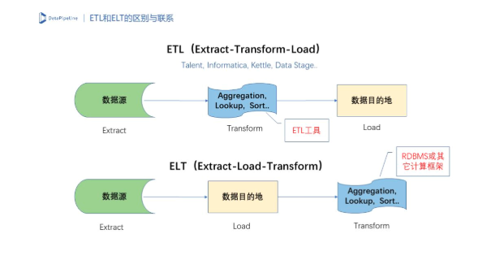

BI (Business Intelligence) 商业智能
------------------

## ETL Extract-Transform-Load
ETL是将业务系统的数据经过抽取(Extract)、清洗转换(Transform)之后加载(Load)到数据仓库（Data Warehouse）或数据集市（Data Mart）中，成为联机分析处理（On-Line Analytical Processing，OLAP）、数据挖掘（Data Mining）的基础。目的是将企业中的分散、零乱、标准不统一的数据整合到一起，为企业的决策提供分析依据。
> **抽取** 是将数据从已有的数据源中提取出来，例如通过 JDBC/Binlog 方式获取 MySQL 数据库的增量数据；**转换** 是对原始数据进行处理，例如将用户属性中的手机号替换为匿名的唯一 ID、计算每个用户对商品的平均打分、计算每个商品的购买数量、将 B 表的数据填充到 A 表中形成新的宽表等；**加载** 是将数据写入目的地。

* [Apache Camel](http://camel.apache.org/)
* [Apatar](http://apatar.com/)
* [Heka](http://hekad.readthedocs.io)
* [ElasticSearch](https://www.elastic.co/products/logstash)
* [Scriptella](http://scriptella.org/)
* [Talend](http://www.talend.com/)
* [Kettle](https://github.com/pentaho/pentaho-kettle)
* [Informatica](https://www.informatica.com/)
* [DataStage](https://www.ibm.com/products/infosphere-datastage)

## ELT
ELT 和 ETL 相比，ETL 在数据源抽取后首先进行转换，然后将转换的结果写入目的地。ELT 则是在抽取后将结果先写入目的地，然后由下游应用利用数据库的聚合分析能力或者外部计算框架，例如 Spark 来完成转换的步骤。最大的区别是“重抽取和加载，轻转换”，从而可以用更简单的技术栈、更轻量的方案搭建起一个满足现代企业应用的数据集成平台。AI 应用内在的特点也使得 ELT 特别适合这个场景。

* [Kafka](https://cwiki.apache.org/confluence/display/KAFKA/Ecosystem)
* [Kafka Connect](https://docs.confluent.io/current/connect/index.html)
* [DataX](https://github.com/alibaba/DataX)
* [DataPipeline](https://www.datapipeline.com/)
