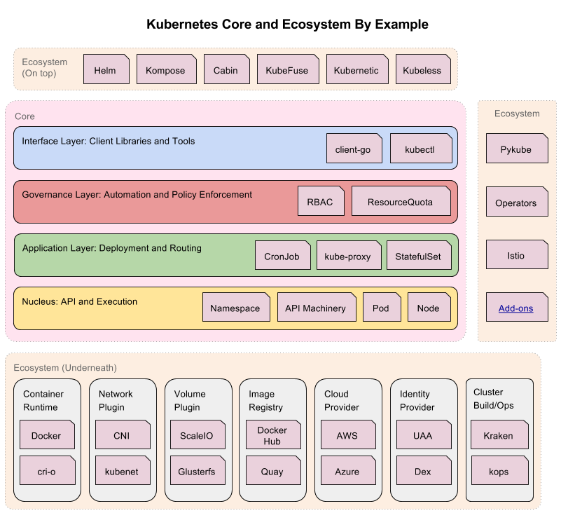

# Kubernetes



## 组件
* etcd 保存了整个集群的状态；
* kube-apiserver 提供了资源操作的唯一入口，并提供认证、授权、访问控制、API 注册和发现等机制；
* kube-controller-manager 负责维护集群的状态，比如故障检测、自动扩展、滚动更新等；
* kube-scheduler 负责资源的调度，按照预定的调度策略将 Pod 调度到相应的机器上；
* kubelet 负责维持容器的生命周期，同时也负责 Volume（CVI）和网络（CNI）的管理；
* Container runtime 负责镜像管理以及 Pod 和容器的真正运行（CRI），默认的容器运行时为 Docker；
* kube-proxy 负责为 Service 提供 cluster 内部的服务发现和负载均衡；
* Ingress Controller 为服务提供外网入口
* Heapster 提供资源监控
* Dashboard 提供 GUI
* Federation 提供跨可用区的集群
* Fluentd-elasticsearch 提供集群日志采集、存储与查询


## HelloWorld

```shell
//minkube
minikube docker-env          //查看docker环境变量
minikube dashboard
```

```shell
kubectl cluster-info          //查看集群信息

kubectl get nodes            //获取节点

//通过kubectl run 部署一个名为kubernetes-bootcamp的容器 --image指定容器镜像 --port指定对外暴露的端口
//Deployment可以理解为应用
//Pod 理解为一组容器的集合，一些息息相关的容器放在一个Pod中，同一个Pod中的容器共享IP和Port空间也就是在同一个命名空间。Pod 在Kubernetes是最小的调度单位，同一Pod中的容器始终被一起调度
kubectl run kubernetes-bootcamp --image=docker.io/jocatalin/kubernetes-bootcamp:v1 --port=8080

kubectl get pods //查看当前pod     --all-namespaces

kubectl describe pod etcd-global-9002d   //查看详细pod

//将容器的8080端口映射到节点端口，随机分配的端口。也是创建服务
kubectl expose deployment/kubernetes-bootcamp --name=z2 --type="NodePort" --port 8080

kubectl get services   //查看创建的服务。可以看到应用被映射到哪个端口

curl localhost:32253 //通过端口号访问应用。32253是刚才查看服务里面找到的对应端口

kubectl get deployments

kubectl scale deployments/kubernetes-bootcamp --replicas=3   //增加三个副本

kubectl scale deployments/kubernetes-bootcamp --replicas=2   //删除一个副本

//更新image，将v1版本升级为v2版本
kubectl set image deployments/kubernetes-bootcamp kubernetes-bootcamp=jocatalin/kubernetes-bootcamp:v2

kubectl rollout undo deployments/kubernetes-bootcamp    //回退image


//通过kubectl exec 可以直接连接到对应的节点
kubectl exec kubernetes-bootcamp-6c5cfd894b-gt6fc -it -- bash -il
kubectl exec kubernetes-bootcamp-6c5cfd894b-gt6fc -it -n namespaces /bin/bash

//查看Pod下对应容器的日志， 使用-f可以直接监听文件变化
kubectl logs -f <POD_NAME> -c <CONTAINER_NAME>

//Endpoint => (Pod Ip + ContainerPort)
kubectl get endpoints

kubectl get namespace

// -n namespaces -l labelkey=labelvalue
kubectl delete deployment -n zzz -l run=test-ubuntu

kubectl run --generator=run-pod/v1 -n zzz -i --tty test-busybox --image=busybox
```

## Ingress

k8s 网关，服务暴露

* ingress-nginx deploy    [官网](https://kubernetes.github.io/ingress-nginx/deploy/)  [博客](https://blog.csdn.net/java_zyq/article/details/82179107)

## Helm
Helm 是 Deis 开发的一个用于 Kubernetes 应用的包管理工具，主要用来管理 Charts。有点类似于 Ubuntu 中的 APT 或 CentOS 中的 YUM。

* [Official Docs](https://helm.sh/docs/intro/)
* [Hello World](https://www.hi-linux.com/posts/21466.html)

### 组件
* Helm
  > Helm 是一个命令行下的客户端工具。主要用于 Kubernetes 应用程序 Chart 的创建、打包、发布以及创建和管理本地和远程的 Chart 仓库。

* Tiller
  > Tiller 是 Helm 的服务端，部署在 Kubernetes 集群中。Tiller 用于接收 Helm 的请求，并根据 Chart 生成 Kubernetes 的部署文件（ Helm 称为 Release ），然后提交给 Kubernetes 创建应用。Tiller 还提供了 Release 的升级、删除、回滚等一系列功能。

* Chart
  > Helm 的软件包，采用 TAR 格式。类似于 APT 的 DEB 包或者 YUM 的 RPM 包，其包含了一组定义 Kubernetes 资源相关的 YAML 文件。

* Repoistory
  > Helm 的软件仓库，Repository 本质上是一个 Web 服务器，该服务器保存了一系列的 Chart 软件包以供用户下载，并且提供了一个该 Repository 的 Chart 包的清单文件以供查询。Helm 可以同时管理多个不同的 Repository。

* Release
  > 使用 helm install 命令在 Kubernetes 集群中部署的 Chart 称为 Release。
