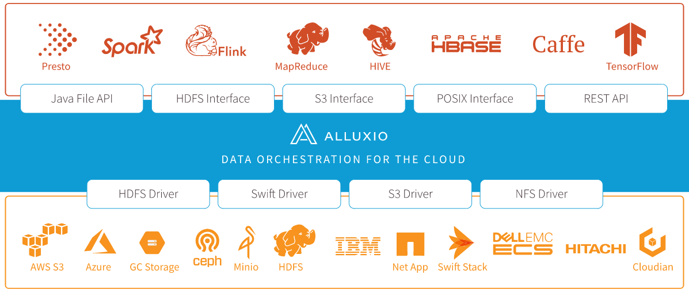

Big Data
--------------

## 涉及关键知识点
### 存储引擎

#### LSM
Log Structured Merge Tree 日志结构合并树
>  Apache HBase, Apache Cassandra, MongoDB(Wired Tiger), LevelDB , RocksDB 都使用 LSM 存储引擎

LSM 类存储引擎，将对数据的修改增量保存在内存中，达到指定大小限制之后批量把数据flush到磁盘中，磁盘中树定期可以做merge操作，合并成一棵大树，以优化写性能。因为数据是先写到内存中，所以为了防止内存数据丢失，会先把数据写入hlog中，也符合了数据库中标准，先写日志，再写数据。

> 不过读取的时候稍微麻烦一些，读取时看这些数据在内存中，如果未能命中内存，则需要访问较多的磁盘文件。极端的说，基于LSM树实现的存储引擎(如：hbase)写性能比`B+树`(如：mysql)高了一个数量级，读性能却低了一个数量级。

### 容错 数据冗余技术
#### 副本策略
Hadoop2.x 中使用了副本方案（Scheme）。存储开销200%  
如果有6个块，将有18个块占用空间
#### 纠删码 Erasure Code
Hadoop3.x 中使用Erasure编码处理容错。存储开销50%  
如果有6个块，将有9个块占用空间，6块block，3块用于奇偶校验。

[Erasure Coding Library](http://jerasure.org/)

#### 磁盘阵列
RAID，Redundant Arrays of Independent Disks，独立磁盘构成的具有冗余能力的阵列
