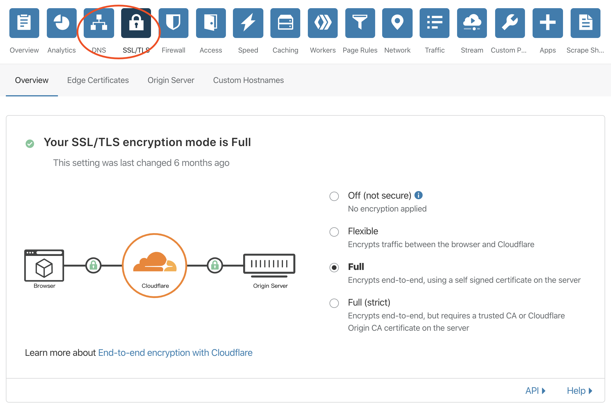

## 关键字

### SSL
Secure Socket Layer  
安全套接字层

位于可靠的面向连接的网络层协议和应用层协议之间的一种协议层。SSL通过互相认证、使用数字签名确保完整性、使用加密确保私密性，以实现客户端和服务器之间的安全通讯。该协议由两层组成：SSL记录协议和SSL握手协议。

### TLS
Transport Layer Security  
传输层安全协议

用于两个应用程序之间提供保密性和数据完整性。该协议由两层组成：TLS记录协议和TLS握手协议。


SSL是Netscape开发的专门用于保护Web通讯的，目前版本为3.0.最新版本的TLS 1.0是IETE（工程任务组）指定的一种新的协议，它建立在SSL 3.0协议规范之上，是SSL 3.0的后续版本。两者差别极小，可以理解为SSL 3.1，它是写入了RFC的。

### ACME
[Automatic Certificate Management Environment](https://tools.ietf.org/html/rfc8555)

ACME 协议最初由 Let's Encrypt 团队开发并被认为是其提供的 CA 服务的核心。ACMEv1 协议旨在确保验证、发布和管理方法是完全自动化、一致、符合合规性和安全的。

ACME成为标准对证书颁发和管理的重要性体现在两个方面。第一是提高了软件生态系统的质量。因为标准确定后，开发者可以专注于针对单个协议开发优秀的软件，而不是为定制的 API 提供许多维护不良的软件。第二，标准化协议大大降低了技术依赖性锁定所带来的影响，使得可从一个 CA 更容易地切换到另一个 CA —— 给予了使用者更自由和便利的选择。

## 申请证书

### 云产商
如阿里云等各大云产商都集成了国内外各种高大上的 CA 机构证书，可以直接购买使用。

### 免费证书

#### 云服务
`cloudflare` `netlify` 等过个国外的 CND PAAS服务商都有提供免费的HTTPS服务，将域名DNS解析指向他们即可。


#### 开源力量

* https://github.com/letsencrypt/letsencrypt
* https://github.com/certbot/certbot

  ```bash
  $ ./letsencrypt-auto --help

  run：获取并安装证书到当前的Web服务器
  certonly：获取或续期证书，但是不安装
  renew：在证书快过期时，续期之前获取的所有证书
  -d DOMAINS：一个证书支持多个域名，用逗号分隔
  --apache：使用 Apache 插件来认证和安装证书
  --standalone：运行独立的 web server 来验证
  --nginx：使用 Nginx 插件来认证和安装证书
  --webroot：如果目标服务器已经有 web server 运行且不能关闭，可以通过往服务器的网站根目录放置文件的方式来验证
  --manual：通过交互式方式，或 Shell

  $ ./letsencrypt-auto run -d ifuture.pro -d www.ifuture.pro --nginx

  ```


* https://github.com/acmesh-official/acme.sh

  [使用教程](https://github.com/acmesh-official/acme.sh/wiki/%E8%AF%B4%E6%98%8E)
