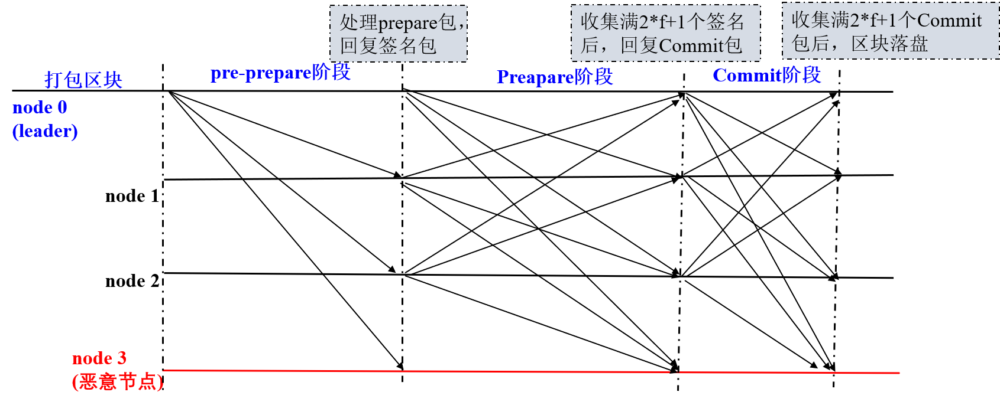

区块链概念汇总
-------------

区块链是由多个学科交叉组合形成的一门技术。
区块链是由分布式架构与分布式存储、块链式数据结构、点对点网络、共识算法、密码学算法、博弈论、智能合约等多种信息技术共同组成的整体解决方案。

## 基础名词

### 钱包
钱包(Wallet)是一个管理私钥的工具
#### 冷钱包
冷钱包(Cold Wallet)是一种脱离网络连接的离线钱包，将数字货币进行离线储存的钱包。使用者在一台离线的钱包上面生成数字货币地址和私钥，再将其保存起来。冷钱包是在不需要任何网络的情况下进行数字货币的储存，因此黑客是很难进入钱包获得私钥的，但它也不是绝对安全的，随机数不安全也会导致这个冷钱包不安全，此外硬件损坏、丢失也有可能造成数字货币的损失，因此需要做好密钥的备份。  
也成硬件钱包。可以简单理解成一个usb硬盘。
#### 热钱包
热钱包(Hot Wallet)是一种需要网络连接的在线钱包，在使用上更加方便。
但由于热钱包一般需要在线使用，个人的电子设备有可能因误点钓鱼网站被黑客盗取钱包文件、捕获钱包密码或是破解加密私钥，而部分中心化管理钱包也并非绝对安全。  
具有代表的交易所中心化钱包（甚至不需要你管理私钥）,被认为相对安全的开源产品Metamask

### 节点
由于区块链是去中心化的分布式数据库，是由千千万万个“小服务器”组成。区块链网络中的每一个节点，就相当于存储所有区块数据的每一台电脑或者服务器。
所有新区块的生产，以及交易的验证与记帐，并将其广播给全网同步，都由节点来完成。  
节点分为“全节点”和“轻节点”，全节点就是拥有全网所有的交易数据的节点，那么轻节点就是只拥有和自己相关的交易数据节点（手机钱包APP）。由于每一个全节点都保留着全网数据，这意味着，其中一个节点出现问题，整个区块链网络世界也依旧能够安全运行，这也是去中心化的魅力所在。

### 智能合约
智能合约本质可以说是一段运行在区块链网络中的代码，它以计算机指令的方式实现了传统合约的自动化处理，完成用户所赋予的业务逻辑  
早在 1995 年就由跨领域法律学者 Nick Szabo 提出：智能合约是一套以数字形式定义的承诺(Promises)，包括合约参与方可以在上面执行这些承诺的协议


### 分叉
分叉一般由区块链系统升级导致
#### 软分叉
软分叉(Soft-fork)更多情况下是一种协议升级，当新共识规则发布后，没有升级的旧节点并不会意识到代码已经发生改变，而继续生产不合法的区块，就会产生临时性分叉，但新节点可以兼容旧节点，即新旧节点始终在同一条链上工作。
#### 硬分叉
硬分叉(Hard-fork)是区块链发生永久性分歧，在新共识规则发布后，已经升级的节点无法验证未升级节点产生的区块，未升级节点也无法验证已经升级的节点产生的区块，即新旧节点互不兼容，通常硬分叉就会发生，原有正常的一条链被分成了两条链（已升级的一条链和未升级的一条链，且这两条链互不兼容）。

### TPS
> 系统每秒钟能够处理的业务数量  
系统的吞吐量  
TPS = 并发数/平均响应时间

> 公链的TPS计算公式为：
  TPS = 一个区块内包含的交易数量 / 区块产生时间 = 一个区块内包含的交易数量 / （共识算法运行的时间 + 广播并验证打包的时间 ）  
  由此算式我们可知，要想提高TPS，有两种途径：  
  1.对区块进行扩容，这样每个区块包含的交易数量就会提高；  
  2.缩短区块产生的时间。  

* 比特币: 7
* 以太坊: 10-20
* EOS: 3000-4000 但宣称可以到100万

> 支付宝双十一 20W+


## 共识
区块链系统本身作为一个超大规模的分布式系统，但又与传统的分布式系统存在明显区别。由于它不依赖于任何一个中央权威，系统建立在去中心化的点对点网络基础之上，因此分散的节点需要就交易的有效与否达成一致，这就是共识算法发挥作用的地方，即确保所有节点都遵守协议规则并保证所有交易都以可靠的方式进行。由共识算法实现在分散的节点间对交易的处理顺序达成一致，这是共识算法在区块链系统中起到的最主要作用。

### 共识算法
* PBFT(Practical Byzantine Fault Tolerance) 拜占庭容错技术  
    > 应用代表: 联盟链. fabric; fisco-bcos;
* POW(Proof of Work) 工作量证明  
    > Bitcoin(比特币); Ethereum(以太访)
* POS(Proof of Stake) 股权证明
    > Peercoin(点点币); 日后以太坊逐渐替换使用
* DPOS(Delegated Proof of Stake) 委任权益证明
    > EOS; Bitshare(比特股)
* Paxos Raft
* Ripple 瑞波

#### PBFT
> f: 无效或恶意节点数  
> R: 总节点数  
> s: 正常节点数  
> v: 系统的view编号，每次选举是触发 view change ,view number++  

前提 f <= (R-1)/3  或  s >= 2f+1 或 R = 3f + 1  
通俗讲就是可以容忍**小于1/3的节点无效或恶意节点**

##### leader 选举
```
leader_idx = (block_number + current_view) % consensus_node_num
```
> 前三轮共识： node0、node1、node2为leader，且非恶意节点数目等于2*f+1，节点正常出块共识；  
第四轮共识：node3为leader，但node3为拜占庭节点，node0-node2在给定时间内未收到node3打包的区块，触发视图切换，试图切换到view_new=view+1的新视图，并相互间广播viewchange包，节点收集满在视图view_new上的(2*f+1)个viewchange包后，将自己的view切换为view_new，并计算出新leader；  
为第五轮共识：node0为leader，继续打包出块。


采用PBFT共识算法的系统，节点规模在百级左右，再增加就会导致TPS下降，确认时延增加。目前业界有通过随机数算法选择记账组的共识机制，可以改善这个问题

##### 角色
* replica 副本节点，备份节点,共识节点,所有参与的节点，接收并检查主节点的排序信息，如果主节点作恶可以进行换选。总数：R
* primary 主节点，共识节点,负责将client的请求排序，发给所有的备份节点。负责将交易打包成区块和区块共识，每轮共识过程中有且仅有一个leader，为了防止leader伪造区块，每轮PBFT共识后，均会切换leader。
* Observer 观察者节点，负责从共识节点或副本节点获取最新区块，执行并验证区块执行结果后，将产生的区块上链。  
> 主节点选举：p = v 求余 R

##### 共识流程
PBFT共识主要包括Pre-prepare、Prepare和Commit三个阶段。



PBFT共识算法中，共识节点轮流出块，每一轮共识仅有一个leader打包区块。节点计算当前leader索引与自己索引相同后，就开始
###### 打包区块 生成Prepare
> **产生新的空块**: 通过区块链(BlockChain)获取当前最高块，并基于最高块产生新空块(将新区块父哈希置为最高块哈希，时间戳置为当前时间，交易清空)；  
**从交易池打包交易**: 产生新空块后，从交易池中获取交易，并将获取的交易插入到产生的新区块中；  
**组装新区块**: Sealer线程打包到交易后，将新区块的打包者(Sealer字段)置为自己索引，并根据打包的交易计算出所有交易的transactionRoot；  
**产生Prepare包**: 将组装的新区块编码到Prepare包内，广播给组内所有共识节点，其他共识节点收到Prepare包后，开始进行三阶段共识。

###### Pre-prepare
共识节点收到Prepare包后，进入pre-prepare阶段，此阶段的主要工作流程包括：
> **Prepare包合法性判断**：主要判断是否是重复的Prepare包、Prepare请求中包含的区块父哈希是否是当前节点最高块哈希(防止分叉)、Prepare请求中包含区块的块高是否等于最高块高加一；  
**缓存合法的Prepare包**: 若Prepare请求合法，则将其缓存到本地，用于过滤重复的Prepare请求；  
**空块判断**：若Prepare请求包含的区块中交易数目是0，则触发空块视图切换，将当前视图加一，并向所有其他节点广播视图切换请求；  
**执行区块并缓存区块执行结果**: 若Prepare请求包含的区块中交易数目大于0，则调用BlockVerifier区块执行器执行区块，并缓存执行后的区块；  
**产生并广播签名包**：基于执行后的区块哈希，产生并广播签名包，表明本节点已经完成区块执行和验证。  

###### Prepare
共识节点收到签名包后，进入Prepare阶段，此阶段的主要工作流程包括：

> **签名包合法性判断**：主要判断签名包的哈希与pre-prepare阶段缓存的执行后的区块哈希相同，若不相同，则继续判断该请求是否属于未来块签名请求(产生未来块的原因是本节点处理性能低于其他节点，还在进行上一轮共识，判断未来块的条件是：签名包的height字段大于本地最高块高加一)，若请求也非未来块，则是非法的签名请求，节点直接拒绝该签名请求；  
**缓存合法的签名包**：节点会缓存合法的签名包；
**判断pre-prepare阶段缓存的区块对应的签名包缓存是否达到2*f+1，若收集满签名包，广播Commit包**：若pre-prepare阶段缓存的区块哈希对应的签名包数目超过2*f+1，则说明大多数节点均执行了该区块，并且执行结果一致，说明本节点已经达到可以提交区块的状态，开始广播Commit包；  
**若收集满签名包，备份pre-prepare阶段缓存的Prepare包落盘**：为了防止Commit阶段区块未提交到数据库之前超过2*f+1个节点宕机，这些节点启动后重新出块，导致区块链分叉(剩余的节点最新区块与这些节点最高区块不同)，还需要备份pre-prepare阶段缓存的Prepare包到数据库，节点重启后，优先处理备份的Prepare包。

###### Commit
共识节点收到Commit包后，进入Commit阶段，此阶段工作流程包括：

> **Commit包合法性判断**：主要判断Commit包的哈希与pre-prepare阶段缓存的执行后的区块哈希相同，若不相同，则继续判断该请求是否属于未来块Commit请求(产生未来块的原因是本节点处理性能低于其他节点，还在进行上一轮共识，判断未来块的条件是：Commit的height字段大于本地最高块高加一)，若请求也非未来块，则是非法的Commit请求，节点直接拒绝该请求；  
**缓存合法的Commit包**：节点缓存合法的Commit包；  
**判断pre-prepare阶段缓存的区块对应的Commit包缓存是否达到2*f+1，若收集满Commit包，则将新区块落盘**：若pre-prepare阶段缓存的区块哈希对应的Commit请求数目超过2*f+1，则说明大多数节点达到了可提交该区块状态，且执行结果一致，则调用BlockChain模块将pre-prepare阶段缓存的区块写入数据库；

###### ViewChange
当PBFT三阶段共识超时或节点收到空块时，PBFTe会试图切换到更高的视图(将要切换到的视图toView加一)，并触发ViewChange处理流程；节点收到ViewChange包时，也会触发ViewChange处理流程：

> **判断ViewChange包是否有效**: 有效的ViewChange请求中带有的块高值必须不小于当前节点最高块高，视图必须大于当前节点视图；  
**缓存有效ViewChange包**： 防止相同的ViewChange请求被处理多次，也作为判断节点是否可以切换视图的统计依据；  
**收集ViewChange包**：若收到的ViewChange包中附带的view等于本节点的即将切换到的视图toView且本节点收集满2*f+1来自不同节点view等于toView的ViewChange包，则说明超过三分之二的节点要切换到toView视图，切换当前视图到toView。


## 隐私保护

数据脱敏，业务隔离,系统物理隔离等方式控制数据分发范围
或引入[密码学](#隐私保护算法)

### 隐私保护算法

* 同态加密
* 零知识证明
* 群签名
* 环签名
* 盲签名
* 安全多发技术

## 区块链产品

### Ethereum (ETH)

* EIP (Ethereum Improvement Protocol)
> 以太坊改进方案。用以改进方案中包括协议规范和合约标准

* ERC (Ethereum Request for Comment)
> Ethereum版的意见征求稿，用以记录以太坊上应用级的各种开发标准和协议(application-level standards and conventions)  
[EIP](https://github.com/ethereum/EIPs)通过后就是ERC了
  * 最典型的Token标准([ERC20](https://eips.ethereum.org/EIPS/eip-20), [ERC721](https://github.com/ethereum/EIPs/blob/master/EIPS/eip-721.md), [ERC223](https://github.com/ethereum/EIPs/issues/223))
  * 名字注册(ERC26, ERC13)
  * URI范式(ERC67)
  * Library/Package格式(EIP82)
  * 钱包格式(EIP75,EIP85)

## 攻击

### 恶意挖矿攻击
恶意挖矿攻击(Cryptojacking)是一种恶意行为，指未经授权的情况下劫持用户设备挖掘加密货币。通常，攻击者会劫持受害者设备(个人 PC 或服务器)的处理能力和带宽，由于加密货币挖掘需要大量算力，攻击者会尝试同时感染多个设备，这样他们能够收集到足够的算力来执行这种低风险和低成本的挖矿活动。

### 无利益攻击
当PoS共识系统出现分叉(Fork)时，出块节点可以在“不受任何损失”的前提下，同时在两个分叉上出块；无论哪一个分叉后面被公认为主链，该节点都可以获得“所有收益”且不会有任何成本损失。这就很容易给某些节点一种动力去产生新的分叉，支持或发起不合法交易，其他逐利的出块节点会同时在多条链(窗口)上排队出块支持新的分叉。随着时间的推移，分叉越来越多，非法交易，作恶猖狂

### 双花攻击
双花攻击(Double Spend Attack)即一笔钱花了两次，双重支付，利用货币的数字特性两次或多次使用“同一笔钱”完成支付。双花不会产生新的 Token，但能把自己花出去的钱重新拿回来。简单说就是，攻击者将一笔 Token 转到另外一个地址，通常是转到交易所进行套现，然后再利用一些攻击手法对转账交易进行回滚。

#### 控制矿工费

Race Attack 这种攻击主要通过控制矿工费来实现双花。攻击者同时向网络中发送两笔交易，一笔交易发给自己(为了提高攻击成功的概率，他给这笔交易增加了足够的矿工费)，一笔交易发给商家。由于发送给自己的交易中含有较高的手续费，会被矿工优先打包进区块的概率比较高。这时候这笔交易就会先于发给商家的那笔交易，那么发给商家的交易就会被回滚。对于攻击者来说，通过控制矿工费，就实现了同一笔 Token 的“双花”。

#### 控制区块的广播时间

Finney Attack  攻击者主要通过控制区块的广播时间来实现双花，攻击对象针对的是接受 0 确认的商家。假设攻击者挖到区块，该区块中包含着一个交易，即 A 向 B 转了一定数量的 Token，其中 A 和 B 都是攻击者的地址。但是攻击者并不广播这个区块，而是立即找到一个愿意接受 0 确认交易的商家向他购买一个物品，向商家发一笔交易，用 A 向商家的地址 C 支付，发给商家的交易广播出去后，攻击者再把自己之前挖到的区块广播出去，由于发给自己的交易先于发给商家的交易，对于攻击者来说，通过控制区块的广播时间，就实现了同一笔 Token 的“双花”。

#### 一次确认攻击
Vector76 Attack 又称“一次确认攻击”，也就是交易确认一次后仍然可以回滚，是 Finney Attack 和 Race Attack 的组合。  
攻击者创建两个节点，节点 A 连接到商家节点，节点 B 连接到区块链网络中的其他节点。接着，攻击者用同一笔 Token 发起两笔交易，一笔交易发送给商家地址，我们称为交易 1；一笔交易发送给自己的钱包地址，我们称为交易 2。与上面说的 Race Attack 一样，攻击者对交易 2 添加了较高的矿工费从而提高了矿工的打包概率，此时，攻击者并没有把这两笔交易广播到网络中去。  
接着，攻击者开始在交易 1 所在的分支上进行挖矿，这条分支我们命名为分支 1。攻击者挖到区块后，并没有广播出去，而是同时做了两件事：在节点 A 上发送交易 1，在节点 B 上发送交易 2。  
由于节点 A 只连接了商家节点，所以当商家节点想把交易 1 传给其它对等节点时，连接了更多节点的节点 B，已经把交易 2 广播给了网络中的大部分节点。于是，从概率上来讲，交易 2 就更有可能被网络认定为是有效的，交易 1 被认定为无效。  
交易 2 被认为有效后，攻击者立即把自己之前在分支 1 上挖到的区块，广播到网络中。这时候，这个接受一次确认就支付的商家，会确认交易成功，然后攻击者就可以立即变现并转移资产。
同时，由于分支 2 连接的更多节点，所以矿工在这个分支上挖出了另一个区块，也就是分支 2 的链长大于分支 1 的链长。于是，分支 1 上的交易就会回滚，商家之前支付给攻击者的交易信息就会被清除，但是攻击者早已经取款，实现了双花。

#### 51% 攻击
攻击者占有超过全网 50% 的算力，在攻击者控制算力的这段时间，他可以创造一条高度大于原来链的新链。那么旧链中的交易会被回滚，攻击者可以使用同一笔 Token 发送一笔新的交易到新链上。

### 异形攻击
异形攻击(Alien Attack)实际上是一个所有公链都可能面临的问题，又称地址池污染，是指诱使同类链的节点互相侵入和污染的一种攻击手法，漏洞的主要原因是同类链系统在通信协议上没有对不同链的节点做识别。  
这种攻击在一些参考以太坊通信协议实现的公链上得到了复现：以太坊同类链，由于使用了兼容的握手协议，无法区分节点是否属于同个链，利用这一点，攻击者先对以太坊节点地址进行收集并进行恶意握手操作，通过跟节点握手达成污染地址池的目的，使得不同链的节点互相握手并把各自地址池里已知的节点推送给了对方，导致更多的节点互相污染，最终扩散致整个网络。遭受异形攻击的节点通常会通信性能下降，最终造成节点阻塞、主网异常等现象。相关公链需要注意持续保持主网健康状态监测，以免出现影响主网稳定的攻击事件出现。

### 供应链攻击
供应链攻击(Supply Chain Attack)是一种非常可怕的攻击方式，防御上很难做到完美规避，由于现在的软件工程，各种包/模块的依赖十分频繁、常见，而开发者们很难做到一一检查，默认都过于信任市面上流通的包管理器，这就导致了供应链攻击几乎已经成为必选攻击之一。把这种攻击称成为供应链攻击，是为了形象说明这种攻击是一种依赖关系，一个链条，任意环节被感染都会导致链条之后的所有环节出问题。

### 交易回滚攻击
交易回滚攻击(Roll Back Attack)，故名思义，指的是能对交易的状态进行回滚。回滚具体是什么意思呢？回滚具体指的是将已经发生的状态恢复成它未发生时候的样子。那么，交易回滚的意思就是将已经发生的交易变成未发生的状态。即攻击者本来已经发生了支付动作，但是通过某些手段，让转账流程发生错误，从而回滚整个交易流程，达到交易回滚的目的，这种攻击手法多发于区块链上的的智能合约游戏当中，当用户的下注动作和合约的开奖动作在一个交易内的时候，即内联交易。攻击者就可以通过交易发生时检测智能合约的某些状态，获知开奖信息，根据开奖信息选择是否对下注交易进行回滚。  
建议开发者们不要将用户的下注与开奖放在同一个交易内，防止攻击者通过检测智能合约中的开奖状态实现交易回滚攻击。

### 交易排挤攻击
交易排挤攻击(Transaction Congestion Attack)是针对 EOS 上的使用 defer 进行开奖的游戏合约的一种攻击手法，攻击者可以通过某些手段，在游戏合约的 defer 开奖交易前发送大量的 defer 交易，恶意侵占区块内的 CPU 资源，使得智能合约内本应在指定区块内执行的 defer 开奖交易因资源不足无法执行，只能去到下一个区块才执行。由于很多 EOS 上的游戏智能合约使用区块信息作为智能合约本身的随机数，同一个 defer 开奖交易在不同区块内的执行结果是不一样的。通过这样的方式，攻击者在获知无法中奖的时候，就通过发送大量的 defer 交易，强行让智能合约重新开奖，从而达到攻击目的。    
建议智能合约开发者对在不同区块内执行结果不同的关键的操作不要采用 defer 交易的方式，降低合约被攻击的风险。

### 随机数攻击
随机数攻击(Random Number Attack)，就是针对智能合约的随机数生成算法进行攻击，预测智能合约的随机数。目前区块链上很多游戏都是采用的链上信息（如区块时间，未来区块哈希等）作为游戏合约的随机数源，也称随机数种子。使用这种随机数种子生成的随机数被称为伪随机数。伪随机数不是真的随机数，存在被预测的可能。当使用可被预测的随机数种子生成随机数的时候，一旦随机数生成的算法被攻击者猜测到或通过逆向等其他方式拿到，攻击者就可以根据随机数的生成算法预测游戏即将出现的随机数，实现随机数预测，达到攻击目的。

### hard_fail状态攻击
hard_fail是什么呢？简单来说就是出现错误但是没有使用错误处理器(error handler)处理错误，比方说使用onerror捕获处理，如果说没有onerror捕获，就会hard_fail。EOS 上的交易状态记录分为  executed,soft_fail, hard_fail, delayed 和 expired 这 5 种状态，通常在链上大部分人观察到的交易，都是 executed 的，或者 delayed 的，而没有失败的交易，这就导致大部分开发者误以为 EOS 链上没有失败的交易记录，从而忽略了对交易状态的检查。攻击者利用这个细节，针对链上游戏或交易所进行攻击，构造执行状态为hard_fail的交易，欺骗链上游戏或交易所进行假充值攻击，从而获利。  
在此提醒交易所和 EOS DApp游戏开发者在处理转账交易的时候需要严格校验交易状态，确保交易执行状态为 executed。

### 重放攻击
重放攻击(Replay Attack)，是针对区块链上的交易信息进行重放，一般来说，区块链为了保证不可篡改和防止双花攻击的发生，会对交易进行各种验证，包括交易的时间戳，nonce，交易 id 等，但是随着各种去中心化交易所的兴起，在智能合约中验证用户交易的场景越来越多。这种场景一般是需要用户对某一条消息进行签名后上传给智能合约，然后在合约内部进行验签。但由于用户的签名信息是会上链的，也就是说每个人都能拿到用户的签名信息，当在合约中校验用户签名的时候，如果被签名的消息不存在随着交易次数变化的变量，如时间戳，nonce 等，攻击者就可以拿着用户的签名，伪造用户发起交易，从而获利。  
这是一种最早出现于DApp生态初期的攻击形态，由于开发者设计的开奖随机算法存在严重缺陷，使得攻击者可利用合约漏洞重复开奖，属于开发者较为容易忽略的错误。因此，开发者们在链上进行验签操作的时候，需要对被签名消息加上各种可变因子，防止攻击者对链上签名进行重放，造成资产损失。

### 重入攻击
重入攻击(Reentrancy Attack)首次出现于以太坊，对应的真实攻击为 The DAO 攻击，此次攻击还导致了原来的以太坊分叉成以太经典(ETC)和现在的以太坊(ETH)。由于项目方采用的转账模型为先给用户发送转账然后才对用户的余额状态进行修改，导致恶意用户可以构造恶意合约，在接受转账的同时再次调用项目方的转账函数。利用这样的方法，导致用户的余额状态一直没有被改变，却能一直提取项目方资金，最终导致项目方资金被耗光。  
提醒智能合约开发者在进行智能合约开发时，在处理转账等关键操作的时候，如果智能合约中存储了用户的资金状态，要先对资金状态进行修改，然后再进行实际的资金转账，避免重入攻击。

### 短地址攻击
短地址攻击(Short Address Attack)是针对以太坊上 ERC20 智能合约的一种攻击形式，利用的是 EVM 中的对于输入字节码的自动补全机制进行攻击。  
一般而言，针对 ERC20 合约中的 transfer 函数的调用，输入的字节码位数都是 136 字节的。当调用 ERC20 中的 transfer 函数进行 ERC20 Token 转账时，如果攻击者提供的地址后有一个或多个 0，那么攻击者就可以把地址后的零省去，提供一个缺位的地址。当对这个地址转账的时候，比方说转账 100 的 A Token，然后输入的地址是攻击者提供的缺位地址，这时候，经过编码输入的数据是 134 字节，比正常的数据少了 2 字节，在这种情况下，EVM 就会对缺失的字节位在编码数据的末尾进行补 0 凑成 136 字节，这样本来地址段缺失的 0 被数据段的 0 补齐了，而由于给地址段补 0，数据段会少 0，而数据段缺失的 0 由 EVM 自动补齐，这就像数据段向地址段移动补齐地址段缺失字节位，然后数据段缺失的字节位由 EVM 用 0 补齐。这种情况下，转账金额就会由 100 变成 100 * 16 的 n 次方，n 是地址缺失的 0 的个数。通过这种方式，攻击者就能对交易所或钱包进行攻击，盗窃交易所和钱包的资产。  
建议交易所和钱包在处理转账的时候，要对转账地址进行严格的校验，防止短地址攻击的发生。

### 整型溢出攻击
数据的存储是区块链上重要的一环。但是每个数据类型本身是存在边界的，例如以太坊中 uint8 类型的变量就只能存储 0～255 大小的数据，超过了就存不下了。那么如果要放一个超过数据类型大小的数字会怎样呢？例如把 256 存进 uint8 的数据类型中，数据显示出来会变成 1，而不是其他数值，也不会报错，因为 uint8 本身能存一个 8 位二进制数字，最大值为 11111111，如果这个时候加 1，这个二进制数就变成了 100000001，而因为数据边界的关系，只能拿到后 8 位，也就是 00000001，那么数字的大小就变成 1 了，这种情况我们称为上溢。有上就有下，下溢的意思就是一个值为 0 的 uint8 数据，如果这个时候对它进行减 1 操作，结果会变成该数据类型所能存储的最大值加 1 减去被减数，在这个例子中是 255，也就是该数据类型所能存储的最大值。那么如果上述两种情况发生在智能合约当中的话，恶意用户通过下溢的操作，操纵自己的帐号向其他帐号发送超过自己余额数量的代币，如果合约内没有对余额进行检查，恶意用户的余额就会下溢出变成一个超大的值，这个时候攻击者如果大量抛售这些代币，就能瞬间破坏整个代币的价值系统。  
建议所有的智能合约开发者在智能合约中对数据进行操作的时候，要严格校验数据边界，防止整形溢出攻击的发生。

### 条件竞争攻击
条件竞争(Race Condition)攻击的方式很多样，但是核心的本质无非是对某个条件的状态修改的竞争。条件竞争的例子：著名的 Edgeware 锁仓合约的拒绝服务漏洞，这个漏洞问题的本质在于对新建的锁仓合约的余额的这个条件进行竞争。攻击者可以监控所有链上的锁仓请求，提前计算出锁仓合约的地址，然后向合约地址转账，造成锁仓失败。在官方没有修复之前，要防止这种攻击，只能使用比攻击者更高的手续费让自己的锁仓交易先行打包，从而与攻击者形成竞争避免攻击。最后，官方修复方案为不对锁仓合约的余额进行强制性的相等检查，而是采用大于等于的形式，避免了攻击的发生。  
建议智能合约的开发者在智能合约中对某些状态进行修改的时候，要根据实际情况充分考虑条件竞争的风险，防止遭受条件竞争攻击。

### 越权访问攻击
和传统安全的定义一样，越权指的是访问或执行超出当前账户权限的操作，如本来有些操作只能是合约管理员执行的，但是由于限制做得不严谨，导致关键操作也能被合约管理员以外的人执行，导致不可预测的风险，这种攻击在以太坊和 EOS 上都曾出现过多次。  
以 EOS 上著名的BetDice游戏为例，由于在游戏合约内的路由(EOS 内可自定义的事件转发器)中没有对来源账号进行严格的校验，导致普通用户能通过 push action 的方式访问到合约中的关键操作 transfer 函数，直接绕过转账流程进行下注，从而发生了越权攻击，事后虽然BetDice官方紧急修复了代码，并严格限制了来源账号，但这个漏洞已经让攻击者几乎无成本薅走BetDice奖池内将近 5 万 EOS。又如在以太坊使用 solidity 版本为 0.4.x 进行合约开发的时候，很多合约开发者在对关键函数编写的时候不仅没有加上权限校验，也没有指定函数可见性，在这种情况下，函数的默认可见性为 public，恶意用户可以通过这些没有进行限制的关键函数对合约进行攻击。  
建议智能合约开发者们在进行合约开发的时候要注意对关键函数进行权限校验，防止关键函数被非法调用造成合约被攻击。

### 交易顺序依赖攻击
在区块链的世界当中，一笔交易内可能含有多个不同的交易，而这些交易执行的顺序会影响最终的交易的执行结果，由于在挖矿机制的区块链中，交易未被打包前都处于一种待打包的 pending 状态，如果能事先知道交易里面执行了哪些其他交易，恶意用户就能通过增加矿工费的形式，发起一笔交易，让交易中的其中一笔交易先行打包，扰乱交易顺序，造成非预期内的执行结果，达成攻击。以以太坊为例，假如存在一个 Token 交易平台，这个平台上的手续费是通过调控合约中的参数实现的，假如某天平台项目方通过一笔交易请求调高交易手续费用，这笔交易被打包后的所有买卖Token的交易手续费都要提升，正确的逻辑应该是从这笔交易开始往后所有的 Token 买卖交易的手续费都要提升，但是由于交易从发出到被打包存在一定的延时，请求修改交易手续费的交易不是立即生效的，那么这时恶意用户就可以以更高的手续费让自己的交易先行打包，避免支付更高的手续费。  
建议智能合约开发者在进行合约开发的时候要注意交易顺序对交易结果产生的影响，避免合约因交易顺序的不同遭受攻击。

### 女巫攻击
传闻中女巫是一个会魔法的人，一个人可以幻化出多个自己，令受害人以为有多人，但其实只有一个人。在区块链世界中，女巫攻击(Sybil Attack)是针对服务器节点的攻击。攻击发生时候，通过某种方式，某个恶意节点可以伪装成多个节点，对被攻击节点发出链接请求，达到节点的最大链接请求，导致节点没办法接受其他节点的请求，造成节点拒绝服务攻击。  
建议在搭建全节点的情况下，服务器需要在系统层面上对网络连接情况进行监控，一旦发现某个IP连接异常就调用脚本配置 iptables 规则屏蔽异常的 IP，同时链开发者在进行公链开发时应该在 P2P 模块中对单 IP 节点连接数量添加控制。

### 假错误通知攻击
EOS 上存在各种各样的通知，只要在 action 中添加require_recipient命令，就能对指定的帐号通知该 action，在 EOS 上某些智能合约中，为了用户体验或其他原因，一般会对onerror通知进行某些处理。如果这个时候没有对onerror通知的来源合约是否是eosio进行检验的话，就能使用和假转账通知同样的手法对合约进行攻击，触发合约中对onerror的处理，从而导致被攻击合约资产遭受损失。
建议智能合约开发者在进行智能合约开发的时候需要对onerror的来源合约进行校验，确保合约帐号为eosio帐号，防止假错误通知攻击。

### 粉尘攻击
粉尘攻击(Dusting Attack)最早发生于比特币网络当中，所谓粉尘，指的是交易中的交易金额相对于正常交易而言十分地小，可以视作微不足道的粉尘。通常这些粉尘在余额中不会被注意到，许多持币者也很容易忽略这些余额。但是由于比特币或基于比特币模型的区块链系统的账本模型是采用 UTXO 模型作为账户资金系统，即用户的每一笔交易金额，都是通过消费之前未消费的资金来产生新的资金。别有用意的用户，就能通过这种机制，给大量的账户发送这些粉尘金额，令交易粉尘化，然后再通过追踪这些粉尘交易，关联出该地址的其他关联地址，通过对这些关联地址进行行为分析，就可以分析一个地址背后的公司或个人，破坏比特币本身的匿名性。除此之外，由于比特币网络区块容量大小的限制，大量的粉尘交易会造成区块的拥堵，从而使得交易手续费提升，进而产生大量待打包交易，降低系统本身的运行效率。  
对于如何避免粉尘攻击，可以在构造交易的过程中，根据交易的类型，计算出交易的最低金额，同时对每个输出进行判断，如果低于该金额，则不能继续构造该笔交易。特别的，如果这个输出刚好发生在找零上，且金额对于你来说不太大，则可以通过舍弃该部分的粉尘输出，以充作交易手续费来避免构造出粉尘交易。其次，为了保护隐私性，建议可以在构造交易时把那些金额极小的 UTXO 舍弃掉，使用大额的 UTXO 组成交易。

### 命令执行与控制 C2
C2 全称 Command and Control，翻译过来就是命令执行与控制，在传统的网络攻击中，在通过各种漏洞进入到目标服务器后，受限于空间，通常通过网络拉取二段 exploit 进行驻留，实现后渗透流程。所以，C2 架构也就可以理解为，恶意软件通过什么样的方式获取资源和命令，以及通过什么样的方式将数据回传给攻击者。在传统的攻击手法中，攻击者一般通过远程服务器拉取命令到本地执行，但是这种方式也有很明显的缺点，就是一旦远程服务器被发现，后续渗透活动就无法正常进行。但是区块链网络提供了一个天然且不可篡改的大型数据库，攻击者通过把攻击荷载(payload)写进交易中，并通过发送交易把该命令永久的刻在区块链数据库中。通过这种方法，即使攻击命令被发现，也无法篡改链上数据，无需担心服务器被发现然后下线的风险。
新技术不断发展，旧有的攻击手法也在随着新技术的变换而不断迭代更新。在区块链的世界中只有在各方面都做好防范，才能避免来自各方面的安全攻击。
