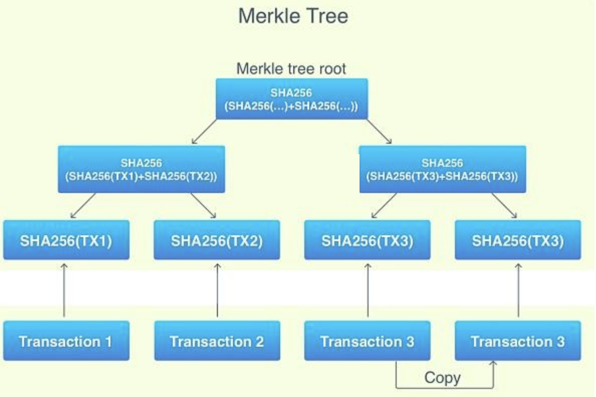
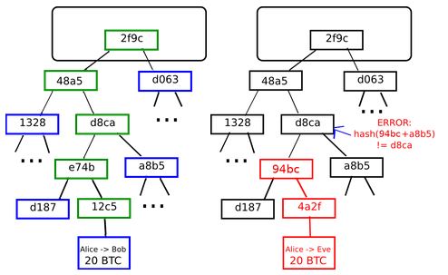

## 共识算法
* PBFT(Practical Byzantine Fault Tolerance) 拜占庭容错技术  
    > 应用代表: 联盟链. fabric; fisco-bcos;
* POW(Proof of Work) 工作量证明  
    > Bitcoin(比特币); Ethereum(以太访)
* POS(Proof of Stake) 股权证明
    > Peercoin(点点币); 日后以太坊逐渐替换使用
* DPOS(Delegated Proof of Stake) 委任权益证明
    > EOS; Bitshare(比特股)
* Paxos Raft
* Ripple 瑞波

### PBFT
> f: 无效或恶意节点数  
> R: 总节点数  
> s: 正常节点数  
> v: 系统的view编号，每次选举是触发 view change ,view number++  

前提 f <= (R-1)/3  或  s >= 2f+1 或 R = 3f + 1  
通俗讲就是可以容忍**小于1/3的节点无效或恶意节点**

#### leader 选举
```
leader_idx = (block_number + current_view) % consensus_node_num
```
> 前三轮共识： node0、node1、node2为leader，且非恶意节点数目等于2*f+1，节点正常出块共识；  
第四轮共识：node3为leader，但node3为拜占庭节点，node0-node2在给定时间内未收到node3打包的区块，触发视图切换，试图切换到view_new=view+1的新视图，并相互间广播viewchange包，节点收集满在视图view_new上的(2*f+1)个viewchange包后，将自己的view切换为view_new，并计算出新leader；  
为第五轮共识：node0为leader，继续打包出块。


采用PBFT共识算法的系统，节点规模在百级左右，再增加就会导致TPS下降，确认时延增加。目前业界有通过随机数算法选择记账组的共识机制，可以改善这个问题

#### 角色
* replica 副本节点，备份节点,共识节点,所有参与的节点，接收并检查主节点的排序信息，如果主节点作恶可以进行换选。总数：R
* primary 主节点，共识节点,负责将client的请求排序，发给所有的备份节点。负责将交易打包成区块和区块共识，每轮共识过程中有且仅有一个leader，为了防止leader伪造区块，每轮PBFT共识后，均会切换leader。
* Observer 观察者节点，负责从共识节点或副本节点获取最新区块，执行并验证区块执行结果后，将产生的区块上链。  
> 主节点选举：p = v 求余 R

#### 共识流程
PBFT共识主要包括Pre-prepare、Prepare和Commit三个阶段。


PBFT共识算法中，共识节点轮流出块，每一轮共识仅有一个leader打包区块。节点计算当前leader索引与自己索引相同后，就开始
##### 打包区块 生成Prepare
> **产生新的空块**: 通过区块链(BlockChain)获取当前最高块，并基于最高块产生新空块(将新区块父哈希置为最高块哈希，时间戳置为当前时间，交易清空)；  
**从交易池打包交易**: 产生新空块后，从交易池中获取交易，并将获取的交易插入到产生的新区块中；  
**组装新区块**: Sealer线程打包到交易后，将新区块的打包者(Sealer字段)置为自己索引，并根据打包的交易计算出所有交易的transactionRoot；  
**产生Prepare包**: 将组装的新区块编码到Prepare包内，广播给组内所有共识节点，其他共识节点收到Prepare包后，开始进行三阶段共识。

##### Pre-prepare
共识节点收到Prepare包后，进入pre-prepare阶段，此阶段的主要工作流程包括：
> **Prepare包合法性判断**：主要判断是否是重复的Prepare包、Prepare请求中包含的区块父哈希是否是当前节点最高块哈希(防止分叉)、Prepare请求中包含区块的块高是否等于最高块高加一；  
**缓存合法的Prepare包**: 若Prepare请求合法，则将其缓存到本地，用于过滤重复的Prepare请求；  
**空块判断**：若Prepare请求包含的区块中交易数目是0，则触发空块视图切换，将当前视图加一，并向所有其他节点广播视图切换请求；  
**执行区块并缓存区块执行结果**: 若Prepare请求包含的区块中交易数目大于0，则调用BlockVerifier区块执行器执行区块，并缓存执行后的区块；  
**产生并广播签名包**：基于执行后的区块哈希，产生并广播签名包，表明本节点已经完成区块执行和验证。  

##### Prepare
共识节点收到签名包后，进入Prepare阶段，此阶段的主要工作流程包括：

> **签名包合法性判断**：主要判断签名包的哈希与pre-prepare阶段缓存的执行后的区块哈希相同，若不相同，则继续判断该请求是否属于未来块签名请求(产生未来块的原因是本节点处理性能低于其他节点，还在进行上一轮共识，判断未来块的条件是：签名包的height字段大于本地最高块高加一)，若请求也非未来块，则是非法的签名请求，节点直接拒绝该签名请求；  
**缓存合法的签名包**：节点会缓存合法的签名包；
**判断pre-prepare阶段缓存的区块对应的签名包缓存是否达到2*f+1，若收集满签名包，广播Commit包**：若pre-prepare阶段缓存的区块哈希对应的签名包数目超过2*f+1，则说明大多数节点均执行了该区块，并且执行结果一致，说明本节点已经达到可以提交区块的状态，开始广播Commit包；  
**若收集满签名包，备份pre-prepare阶段缓存的Prepare包落盘**：为了防止Commit阶段区块未提交到数据库之前超过2*f+1个节点宕机，这些节点启动后重新出块，导致区块链分叉(剩余的节点最新区块与这些节点最高区块不同)，还需要备份pre-prepare阶段缓存的Prepare包到数据库，节点重启后，优先处理备份的Prepare包。

##### Commit
共识节点收到Commit包后，进入Commit阶段，此阶段工作流程包括：

> **Commit包合法性判断**：主要判断Commit包的哈希与pre-prepare阶段缓存的执行后的区块哈希相同，若不相同，则继续判断该请求是否属于未来块Commit请求(产生未来块的原因是本节点处理性能低于其他节点，还在进行上一轮共识，判断未来块的条件是：Commit的height字段大于本地最高块高加一)，若请求也非未来块，则是非法的Commit请求，节点直接拒绝该请求；  
**缓存合法的Commit包**：节点缓存合法的Commit包；  
**判断pre-prepare阶段缓存的区块对应的Commit包缓存是否达到2*f+1，若收集满Commit包，则将新区块落盘**：若pre-prepare阶段缓存的区块哈希对应的Commit请求数目超过2*f+1，则说明大多数节点达到了可提交该区块状态，且执行结果一致，则调用BlockChain模块将pre-prepare阶段缓存的区块写入数据库；

##### ViewChange
当PBFT三阶段共识超时或节点收到空块时，PBFTe会试图切换到更高的视图(将要切换到的视图toView加一)，并触发ViewChange处理流程；节点收到ViewChange包时，也会触发ViewChange处理流程：

> **判断ViewChange包是否有效**: 有效的ViewChange请求中带有的块高值必须不小于当前节点最高块高，视图必须大于当前节点视图；  
**缓存有效ViewChange包**： 防止相同的ViewChange请求被处理多次，也作为判断节点是否可以切换视图的统计依据；  
**收集ViewChange包**：若收到的ViewChange包中附带的view等于本节点的即将切换到的视图toView且本节点收集满2*f+1来自不同节点view等于toView的ViewChange包，则说明超过三分之二的节点要切换到toView视图，切换当前视图到toView。


## 轻节点

### 默克尔树 Merkle tree
> 在比特币的白皮书中提到了轻节点也就是简易支付验证(Simplified Payment Verification,SPV)，它正是基于默克尔可信树利用区块中的所有交易 hash 生成的一个默克尔根节点，保存至区块头，可用于验证交易是否打包到某区块中。



每个块都会有一个Merkle树,它从叶子节点(树的底部)开始,一个叶子节点就是一个交易哈希,叶子节点的数量必须是双数(如果区块里交易数是单数，就复制最后一份凑成双数)。从下往上,两两成对,连接两个节点哈希,将组合哈希作为新的哈希。新的哈希就成为新的树节点。重复该过程,直到仅有一个节点,也就是树根。根哈希然后就会当做是整个块交易的唯一标示,将它保存到区块头,然后用于工作量证明。


左：仅提供默克尔树（Merkle tree）上的少量节点已经足够给出分支的合法证明。  
右：任何对于默克尔树的任何部分进行改变的尝试都会最终导致链上某处的不一致。  

Merkle树的好处就是一个节点可以在不下载整个块的情况下,验证是否包含某笔交易。并且这些只需要一个交易哈希,一个Merkle树根哈希和一个Merkle路径
